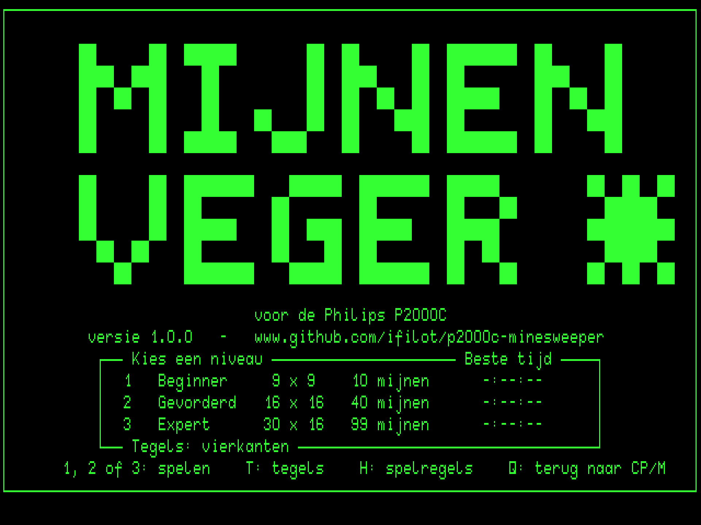
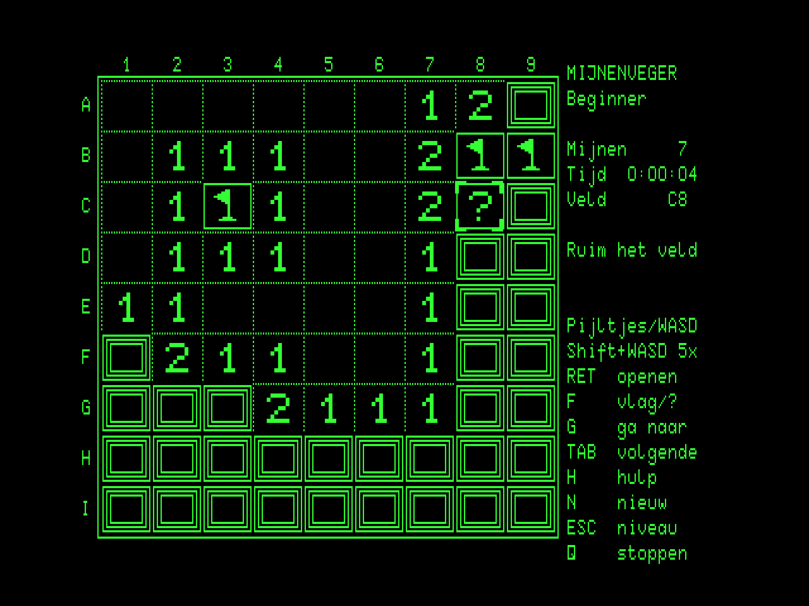
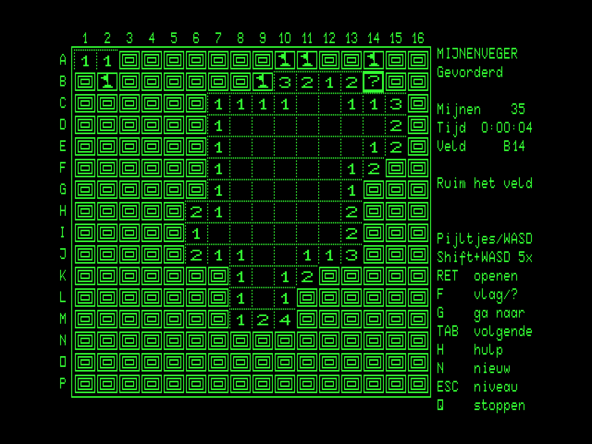
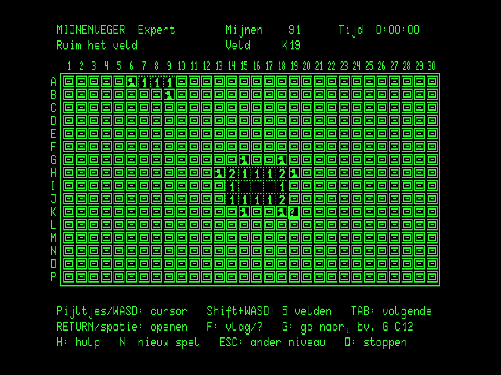
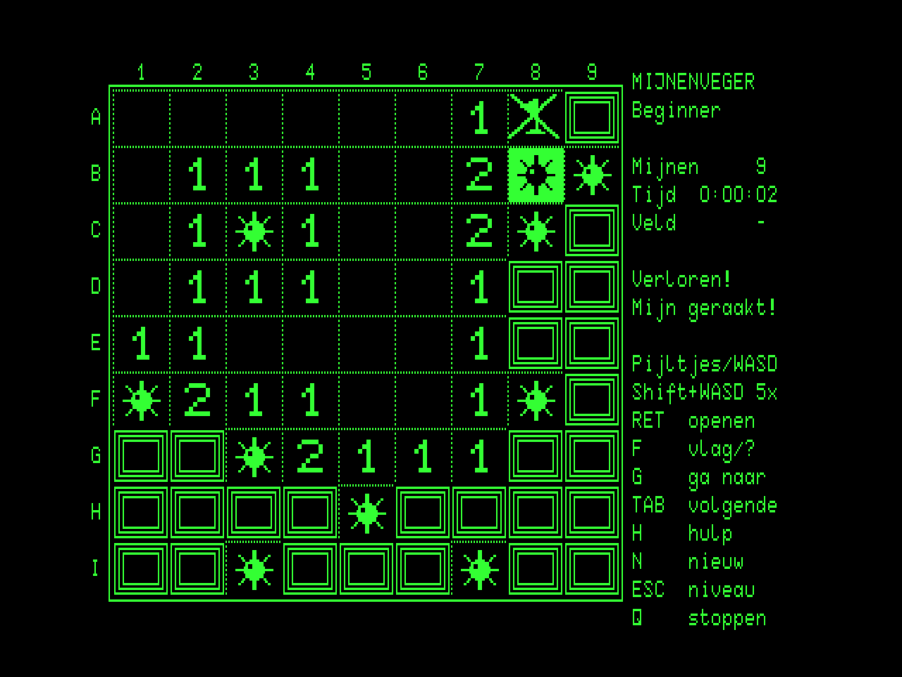
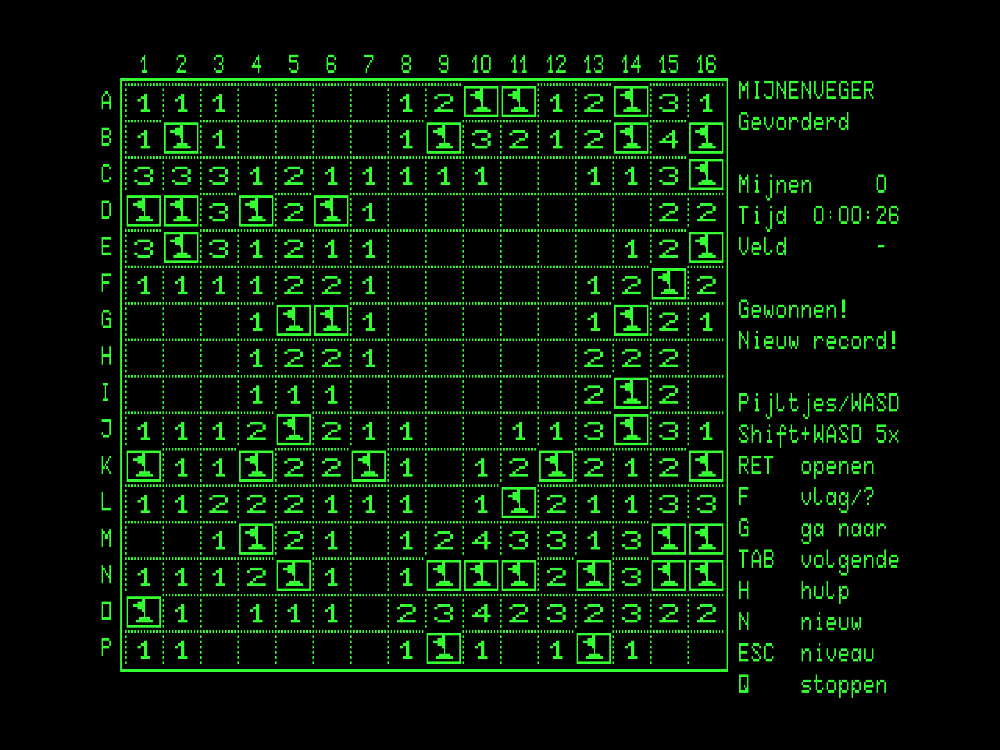
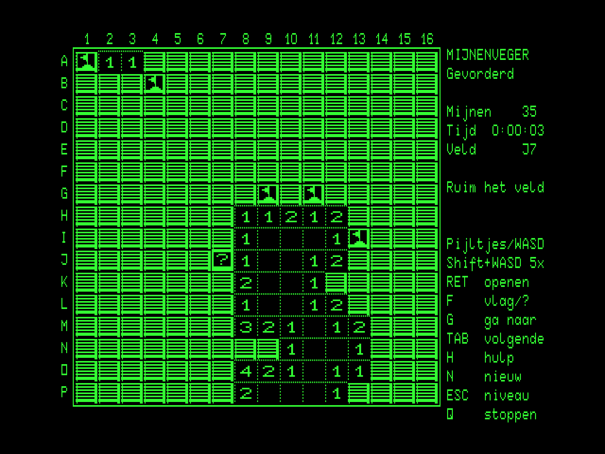

# Mijnenveger (Minesweeper) for the Philips P2000C

[](https://github.com/ifilot/p2000c-minesweeper/actions/workflows/build.yml)
[](https://github.com/ifilot/p2000c-minesweeper/releases)
[](LICENSE)

Mijnenveger, the classic game of Minesweeper, for the Philips P2000C running
CP/M. The minefield is drawn in the terminal board's 512x252
high-resolution graphics mode: closed cells as three concentric squares
(or, switchable, raised scanline-hatched buttons), flags, question marks,
sea mines, and the one that went off. The text plane
carries the panel. The user interface is in Dutch. The three classic
levels are offered at the start, each with the largest square cells that
fit the screen.

<p align="center">
  
  
</p>
<p align="center">
  
  
</p>
<p align="center">
  
  
</p>
<p align="center">
  
</p>

## Play

Download `MINES.COM` from the [releases](https://github.com/ifilot/p2000c-minesweeper/releases)
(or the latest [build artifact](https://github.com/ifilot/p2000c-minesweeper/actions)),
copy it to a CP/M disk and run `MINES`. With a ZuluBlaster/SASI setup,
`make deploy` produces `build/HD1_256.hda`, a second-disk image in the
standard split layout with the game on F:. Copy it to the SD card in place
of the distribution's `HD1_256.hda` and run `F:MINES`. The program opens
on the start screen, which is plain text and appears instantly. It shows
the best time per level; `1`, `2` or `3` starts a game, and `T` switches
the closed tiles between *vierkanten* (three concentric squares, the
default) and *strepen* (raised buttons with a hatched face). The choice
is remembered.

| Level | Board | Mines | Cell (dots) |
| --- | --- | --- | --- |
| 1 *Beginner* | 9 x 9 | 10 | 40 x 24 |
| 2 *Gevorderd* | 16 x 16 | 40 | 24 x 14 |
| 3 *Expert* | 30 x 16 | 99 | 16 x 10 |

Open every cell that holds no mine. An open cell shows how many of its
eight neighbours hide a mine; a cell without any opens its whole
surroundings by itself. The first cell you open is always safe and always
clears an area: the mines are laid only then, never on or next to it. The
clock starts with that first cell. Rows are lettered A-P and columns
numbered, so a cell has a name such as `C12` (row C, column 12).

| Key | Action |
| --- | --- |
| Cursor keys or `W` `A` `S` `D` | Move the cursor one cell |
| Shift + `W` `A` `S` `D` | Move five cells (stops at the edge) |
| `TAB` | Jump to the next closed cell without a flag |
| `G`, then e.g. `C12` | Go to cell C12: the jump happens as soon as the number is complete (or on `RETURN`); `BS` corrects, `ESC` cancels |
| `RETURN` or space | Open the cell. On an open number whose flags are all placed: open all its other neighbours ("chording") |
| `F` | Flag, then question mark, then nothing |
| `H` | Help screen with the rules (plain text mode) |
| `N` | New game at the same level |
| `ESC` | Back to the start screen (another level) |
| `Q` | Quit, after confirmation (immediate on the start screen) |
| `T` (start screen) | Closed tiles: concentric squares or hatched buttons |

Giving up a game in progress with `N` or `ESC` asks for a confirmation.
The panel shows the mines left (mines minus flags), the game clock and
the name of the cursor's cell. A lost game reveals every mine, crosses out
the flags that were wrong and shows the mine that went off in inverse
video. A won game flags all mines; a new best time is stored in
`MINES.DAT` on the current drive, together with the tile style. After five minutes without a keypress a
screen saver blanks the picture; any key brings it back.

## Build

The program is C (Z88DK/sdcc) with the display driver in Z80 assembly. It
is compiled with the `z88dk/z88dk` Docker image:

```sh
make build            # -> build/MINES.COM
```

The other targets use the sibling checkouts
[p2000c-cpm-disk-tool](https://github.com/ifilot/p2000c-cpm-disk-tool)
(headless emulator, CP/M disk images) and
[p2000c-emulator](https://github.com/ifilot/p2000c-emulator) (graphical
emulator, character-ROM font):

```sh
make run              # open the game in the graphical emulator (WSLg/Linux)
make screenshot       # plain raster dumps (green on black) -> build/*.png
make test             # whole games at every level in the headless emulator
make deploy           # build/HD1_256.hda: second SASI disk with MINES.COM on F:
make sprites          # regenerate src/sprites.h (preview: build/sprites_preview.png)
python3 tools/bench.py    # bytes over the terminal link per action, per level
```

`make test` reads the minefield from memory after the first cell (the
emulator is deterministic, so a second run meets the same field) and then
plays: it checks the layout and the flood rule, cursor keys, `TAB`, the
flag cycle and the mines counter, a chord, a whole won game opened cell by
cell with `G`, the best time on the start screen, and a lost game. At six
moments, in both tile styles, it also compares the terminal's graphics RAM
with the program's framebuffer dot for dot.

## Layout

| File | Contents |
| --- | --- |
| `src/main.c` | Program flow: start screen, games |
| `src/game.c`, `src/game.h` | Game state, keys (cursor, `G` jump, `TAB`), opening, chording, flags, end of a game |
| `src/field.c`, `src/field.h` | The minefield: mine placement after the first cell, flood opening, chording, flag cycle |
| `src/screen.c`, `src/screen.h` | Board picture: geometry per level, tiles, vector lattice, uploads of what changed |
| `src/panel.c`, `src/panel.h` | Panel on the text plane: beside the board, or above and below it for Expert |
| `src/screens.c`, `src/screens.h` | Start and help screens (text mode) |
| `src/scores.c`, `src/scores.h` | Best times and the tile style in `MINES.DAT` (BDOS file calls) |
| `src/clock.c`, `src/clock.h` | Game clock (h:mm:ss) from the BIOS's documented 60 Hz system timer |
| `src/saver.c`, `src/saver.h` | Screen saver: after five idle minutes the picture is blanked and a dim caption wanders the text screen |
| `src/video.asm`, `src/video.h` | Framebuffer primitives, `ESC r` row uploads, BIOS console I/O, BDOS call |
| `src/sprites.h` | Generated tiles (two closed-tile styles), their line operations, cursor, labels |
| `tools/` | Tile generator, emulator launcher, screenshots, tests, benchmark |

## License

GNU General Public License v3.0; see [LICENSE](LICENSE). The character-ROM
font sheet used only by the generator and the screenshot tooling belongs
to the [p2000c-emulator](https://github.com/ifilot/p2000c-emulator)
project.
